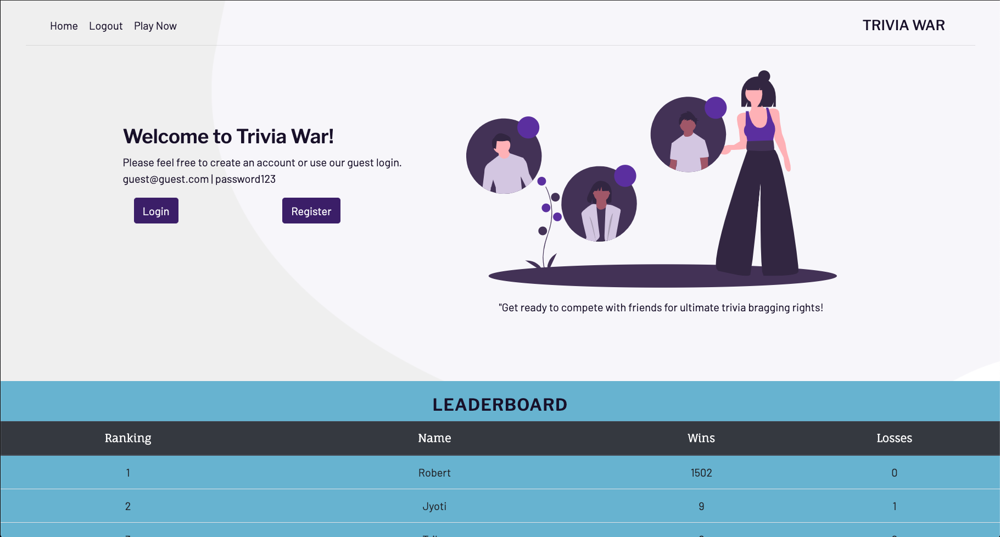
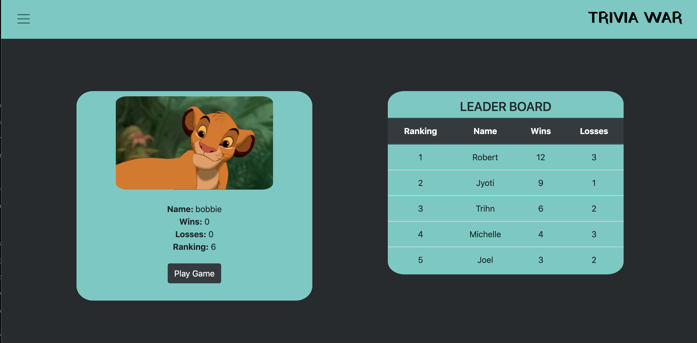

## Trivia Wars
[Link to deployed site](https://boiling-earth-81626.herokuapp.com/) 
What is 1 mile converted to kilometers? 
How deep is the deepest point of the Pacific Ocean?
How old is the world's longest living cat?

 Trivia Wars provides users with the opportunity to learn and compete in a variety of different topics including Music, Math, Geography, and Sports in a fun and dynamic way. Our app incorporates a classic trivia quiz approach, but also provides users with the choice of either a single player or multiplayer mode. In addition to these different game modes, users can register and keep track of their stats and performance with a live leaderboard and stat tracker on the user homepage. The live leaderboard tracks user results in both game modes and reflects cumulative performance, which adds a fun, competitive element to each game played.
 
## Technologies
 - JavaScript
 - React.js
 - Express.js
 - Socket.io
 - MongoDB
 - Mongoose
 - Passport.js
 
 ## Installation
To run this app on your local machine, first run 'npm run seed' in order to get your database up and running  on your local machine (Note: you must also have mongod running in you terminal). 

You can then run 'npm start' to get the react app running on the local host. Once you have the app running you can log in, or register if you don't have an account yet, and will be taken to the user page with your stats printed on the left and the overall leaderboard on the right.

### After Redesign

### Before Redesign

## How to Use our App
### Log on!
After you create an account, from your homepage, you can choose to start a new game. Here, you'll be able to select what mode you'd like to play in.

 ### Single Player
If you've chosen single player, your game will start immediately. Your score will be counted as a win only if you get 70% or higher correct. 

### Multiplayer
If you've chosen multiplayer, you will be automatically added to matchmaking. Our server will connect you with the first person to select the same category as you. After you've found a partner, it's time to play! The person who gets the most points wins.

## DEMO
### Video Demo
[Trivia War Demo - Youtube](https://www.youtube.com/watch?v=73ksJEpYj_U)

### Guest Login
https://boiling-earth-81626.herokuapp.com/ \
 Name: guest@guest.com\
 PW: password123
